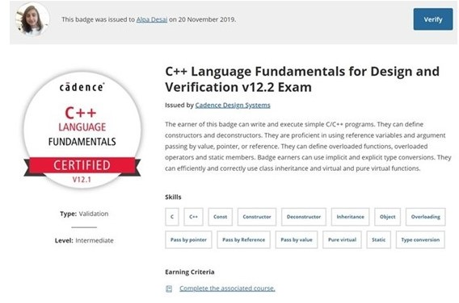
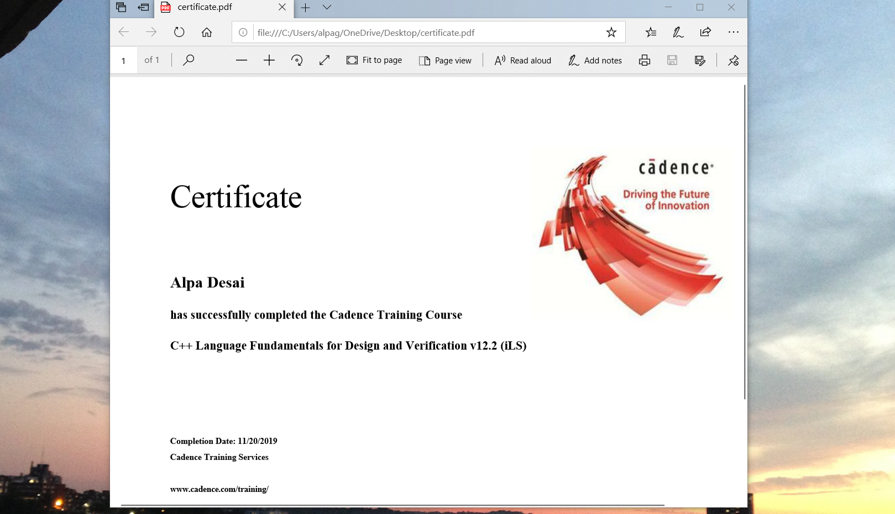
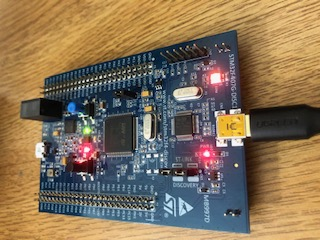

# Coding RTOS

The project provides introduction to coding RTOS. The project is TBD

All images are custom by Alpa D. Desai or have references

## C++ Language Fundamentals

## Programming a STM32F407 DISCOVERY board

### Reference : Udemy certificate: Mastering RTOS: Hands on FreeRTOS and STM32Fx with Debugging

Additional reference https://github.com/alpaddesai/ArchitecturalProductDesign
