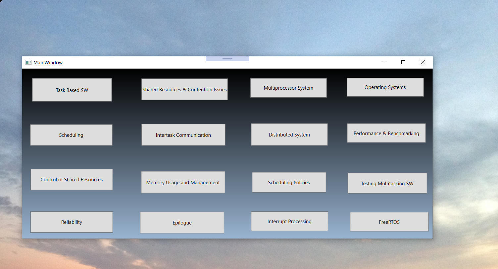
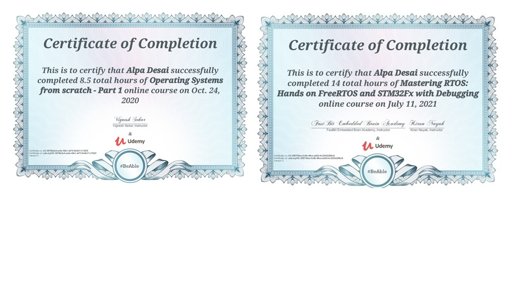
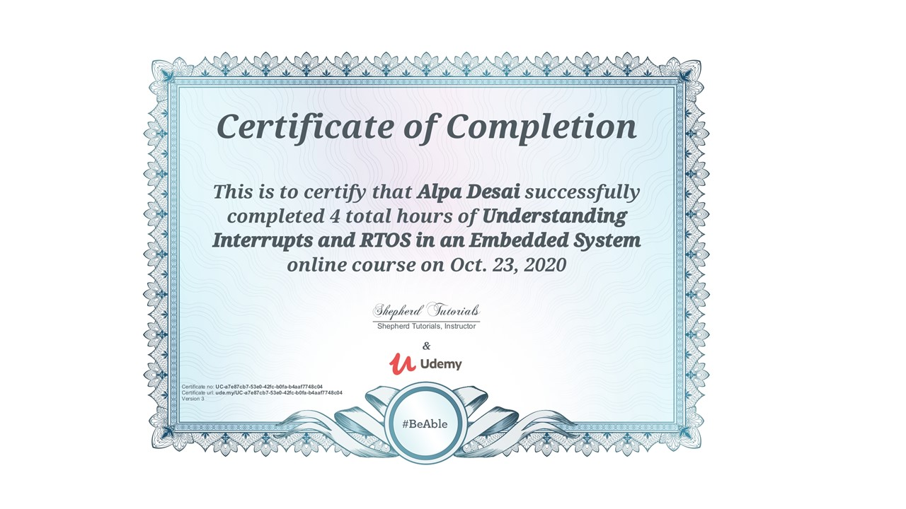

# Coding RTOS

The project provides introduction to coding RTOS. The project is TBD

All images are custom by Alpa D. Desai or have references

Please reference https://github.com/alpaddesai/CodingRTOS/releases  for details.

## RTOS 

## C++ Language Fundamentals

## RTOS

## Interrupts

## Page Tables

## Operating Systems

## Synchronization

## File Systems

Additional reference : https://github.com/alpaddesai/NewProductDevelopmentProcesses
