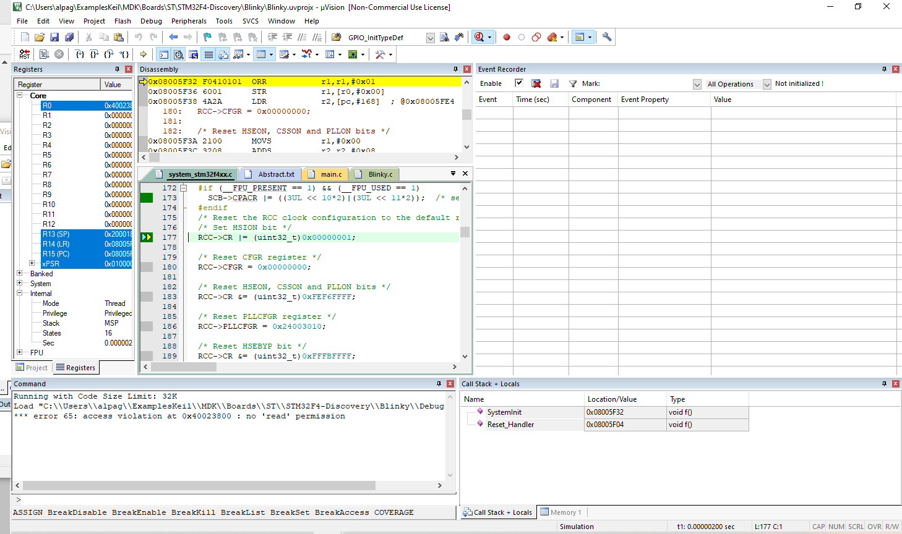
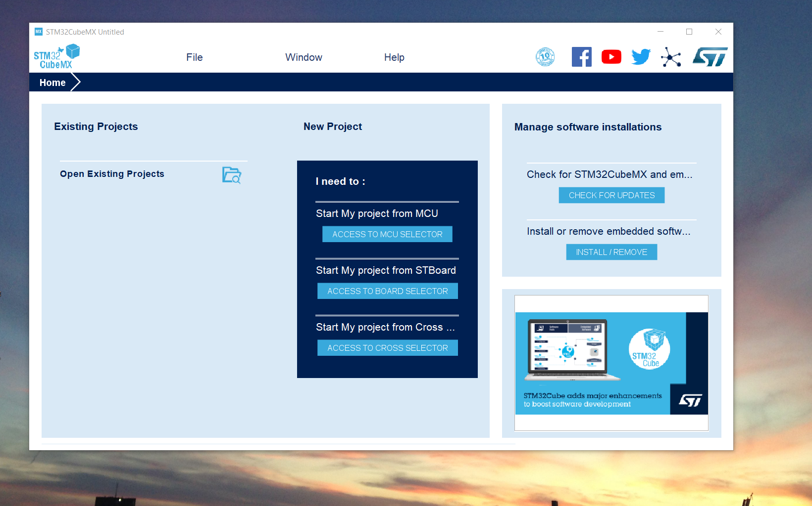

# Coding RTOS

The project provides introduction to coding RTOS. The project is TBD

All images are custom by Alpa D. Desai or have references

Please reference https://github.com/alpaddesai/CodingRTOS/releases  for details.

## RTOS 

## uVision

## STM32Cube

Yet to complete the graduate level coursework. 
Read error, need to simulate the platform (memories, interfaces, controllers) Purchase the hardware or license to FVP fast models either option, experienced professionals.

