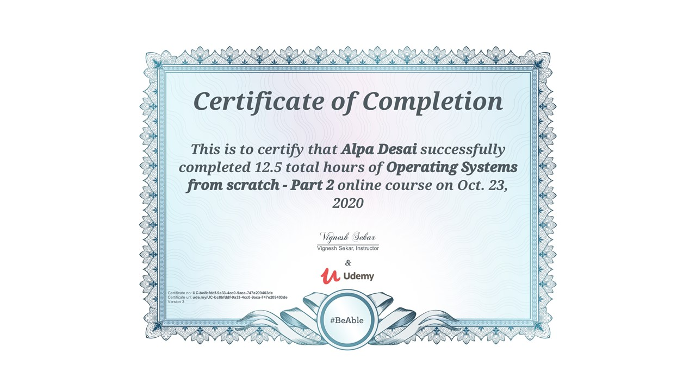
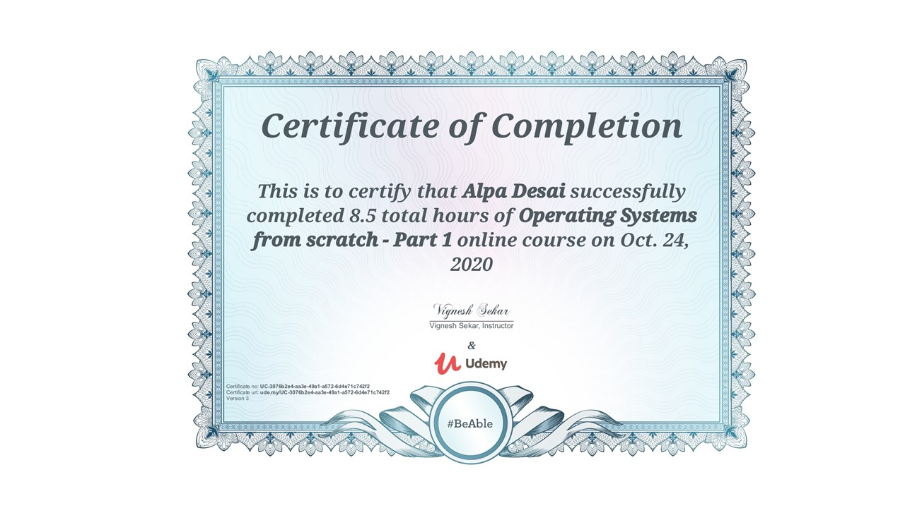
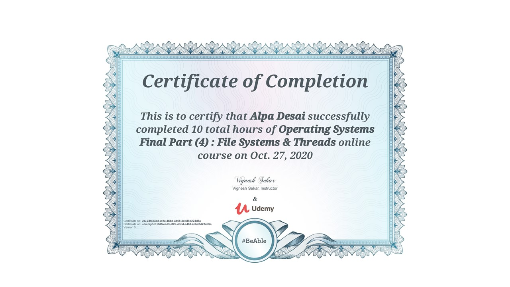
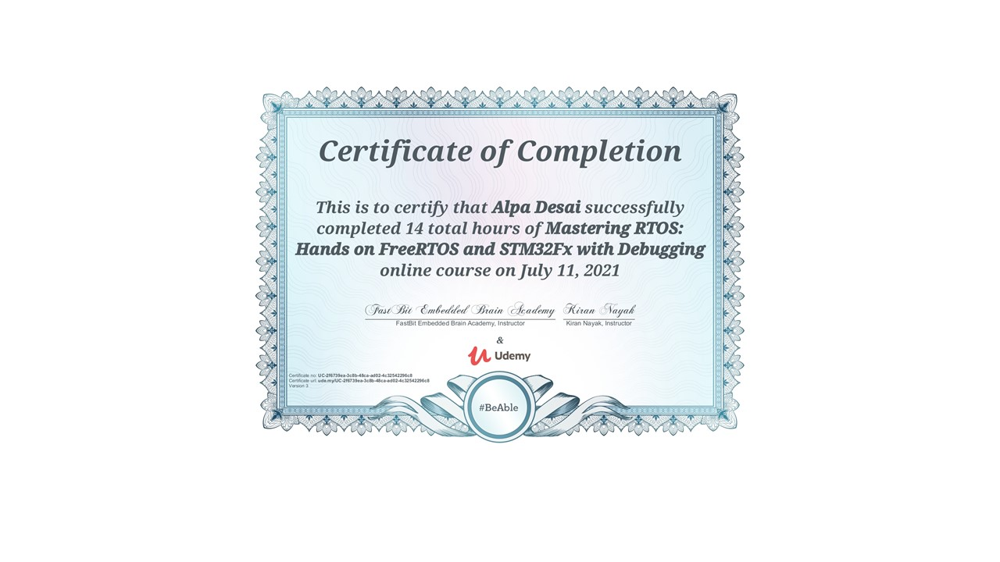

# Coding RTOS

The project provides introduction to coding RTOS. The project is TBD

All images are custom by Alpa D. Desai or have references

## C++ Language Fundamentals

## Page Tables

## Operating Systems

## Synchronization

## File Systems

## RTOS Certificate
##### basic knowledge - incomplete -queue. 

## Programming a board

Additional reference https://github.com/alpaddesai/ArchitecturalProductDesign
