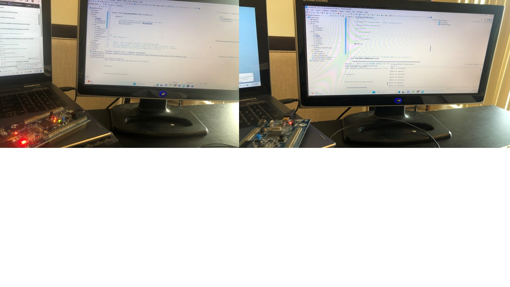

# Coding RTOS

The project provides introduction to coding RTOS. 

All images are custom by Alpa D. Desai or have references

## Firmware quiz

## Operating Systems

## C++ Language Fundamentals

## Programming a STM32F4xx DISCOVERY board. uKeilVision

## Programming a STM32F4xx DISCOVERY board, STM32CubeIDE

Additional reference https://github.com/alpaddesai/EmbeddedProgramming
